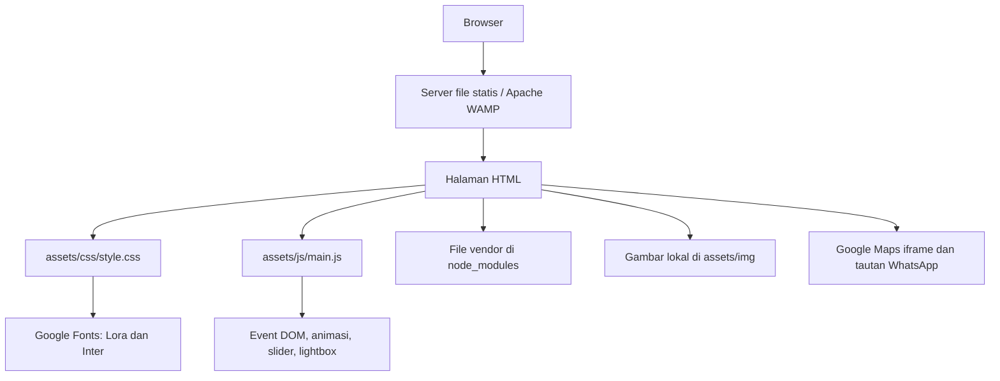

# Website Profil RSU El-Syifa Kuningan

Website profil rumah sakit berbahasa Indonesia yang menyajikan layanan, dokter, ruang rawat, artikel, galeri, dan informasi kontak. Dokumentasi ini memetakan implementasi yang ada agar developer dan AI dapat menentukan file yang perlu dipelajari atau diubah.

Pemetaan terakhir: **29 September 2026**, berdasarkan file di workspace. Konten rumah sakit, jadwal, statistik, dan artikel ditulis langsung dalam HTML; keberadaannya di kode bukan verifikasi data operasional rumah sakit.

## 1. Ringkasan arsitektur

| Aspek | Implementasi saat ini |
| --- | --- |
| Jenis aplikasi | Website statis dengan beberapa halaman HTML (multi-page) |
| Entry point | `index.html` |
| Tampilan | HTML5, Bootstrap, MDB UI Kit, Bootstrap Icons, CSS kustom |
| Interaksi | jQuery, Swiper, dan browser API `IntersectionObserver` |
| Sumber data | Teks, atribut, dan kartu yang ditulis langsung di setiap HTML |
| Navigasi | Tautan file `.html` dan anchor `#id`; tanpa router aplikasi |
| Backend dan penyimpanan | Belum ada backend, API aplikasi, database, autentikasi, atau CMS |
| Build | Tanpa bundler/transpiler; generator Node opsional untuk memperbarui kartu dan halaman unit |
| Dependency manager | npm; browser memuat file distribusi langsung dari `node_modules/` |
| Pengujian | Pemeriksaan aset gambar dan tes checker melalui Node.js; workflow GitHub Actions |



Server hanya menyajikan file. Browser membentuk tampilan dari HTML dan CSS, lalu menjalankan handler di `$(document).ready(...)`. Tidak ada pengambilan data aplikasi melalui AJAX/fetch maupun penyimpanan state permanen di kode aplikasi saat ini.

## 2. Struktur direktori

```text
wb-rumah-sakit/
|-- index.html                 # Beranda dan ringkasan seluruh informasi
|-- dokter.html                # Daftar dokter beserta jadwal berbentuk teks
|-- ruang-rawat.html            # Daftar kategori ruang dan fasilitas
|-- artikel.html               # Daftar ringkasan artikel/berita
|-- ketentuan-pengguna.html     # Aturan penggunaan situs informasi
|-- kebijakan-privasi.html      # Privasi pengunjung dan layanan eksternal
|-- cookie.html                # Cookie dan pengaturan browser
|-- unit/                      # Halaman detail mandiri untuk masing-masing unit
|-- scripts/
|   `-- build-units.cjs         # Generator detail dan kartu unit di beranda
|-- assets/
|   |-- data/
|   |   `-- units.json         # Data unit, penjelasan, personel, dan foto
|   |-- css/
|   |   `-- style.css          # Design tokens, komponen, animasi, responsivitas
|   |-- js/
|   |   |-- main.js            # Interaksi bersama berbasis jQuery
|   |   |-- preloader.js       # Kontrol preloader mandiri tanpa dependency
|   |   `-- units.js           # Pagination unit: 6 kartu desktop / 4 mobile
|   |-- fonts/
|   |   |-- fonts.css          # Deklarasi font lokal; belum dimuat halaman
|   |   `-- *.woff2/woff/ttf   # Koleksi font lokal
|   `-- img/
|       |-- Direktur/          # Foto direktur
|       |-- Dokter/            # Koleksi foto dokter
|       |-- Hero/              # Gambar slider beranda
|       |-- Logo/              # Logo rumah sakit
|       |-- Pavicon/           # Favicon, ikon perangkat, site.webmanifest
|       `-- Struktur_Organisasi/ # Koleksi gambar struktur organisasi
|-- node_modules/              # Hasil instalasi npm; diabaikan Git
|-- package.json               # Deklarasi lima dependency langsung
|-- package-lock.json          # Versi dependency yang dikunci
|-- .gitignore                 # Mengabaikan dependency, output, env, log, dll.
|-- LICENSE                    # Lisensi MIT
`-- README.md                  # Peta arsitektur dan panduan studi proyek
```

Nama direktori `Pavicon` mengikuti ejaan yang benar-benar digunakan kode. Pertahankan kapitalisasi path saat mengubah referensi agar cocok pada hosting dengan filesystem case-sensitive. Gambar struktur organisasi dan koleksi font tersedia di disk, tetapi belum terhubung ke empat halaman saat pemetaan ini dibuat.

## 3. Peta halaman dan konten

| File | Tanggung jawab | Bentuk konten utama |
| --- | --- | --- |
| [index.html](index.html) | Beranda lengkap | Hero, statistik, profil, slider layanan, galeri, testimoni, mitra, kontak |
| [dokter.html](dokter.html) | Daftar dokter | Grid kartu foto, nama, spesialisasi, dan jadwal |
| [ruang-rawat.html](ruang-rawat.html) | Informasi rawat inap | Kartu VIP, kelas 1–3, ICU, perinatologi, dan ajakan menghubungi rumah sakit |
| [artikel.html](artikel.html) | Daftar artikel dan berita | Kartu gambar, tanggal, judul, ringkasan, tombol baca |
| [ketentuan-pengguna.html](ketentuan-pengguna.html) | Ketentuan Pengguna | Cakupan informasi, penggunaan materi, layanan eksternal, dan kontak |
| [kebijakan-privasi.html](kebijakan-privasi.html) | Kebijakan Privasi | Data pengunjung, komunikasi, penyedia eksternal, dan permintaan terkait data |
| [cookie.html](cookie.html) | Kebijakan Cookie | Penggunaan cookie, konten eksternal, dan pilihan browser; bukan panel persetujuan |

Tujuh halaman menyalin markup top bar, navbar, dan footer; empat halaman utama juga memuat tombol WhatsApp dan tombol kembali ke atas. Belum ada template/partial bersama. Footer berisi identitas rumah sakit serta ringkasan dan tautan Ketentuan Pengguna, Kebijakan Privasi, dan Cookie. Perubahan menu, identitas, atau kontak perlu diperiksa di seluruh halaman. Ringkasan dokter, ruang, dan artikel di beranda juga terpisah dari halaman daftarnya; tidak tersinkron otomatis.

Halaman kebijakan memakai class `.policy-*` di CSS bersama dan saling terhubung melalui navigasi dokumen. Redaksinya mengikuti fitur situs saat ini, bukan kebijakan rekam medis rumah sakit. Jika pengelolaan data, hosting, atau integrasi berubah, sesuaikan isi dan tanggal pembaruan. Tidak ada panel persetujuan cookie atau pemblokiran Google Maps/Fonts yang ditambahkan oleh halaman ini.

Urutan section di `index.html`:

| ID / anchor | Isi | Kaitan kode |
| --- | --- | --- |
| `hero` | Banner utama | `.hero-swiper` |
| `statistik` | Statistik rumah sakit | `.stat-number[data-target]` |
| `sambutan` | Sambutan direktur | Foto di `assets/img/Direktur/` |
| `sejarah` | Sejarah rumah sakit | Konten HTML |
| `visi-misi` | Visi dan misi | Konten HTML |
| `poliklinik` | Layanan spesialis | `.poliklinik-swiper` |
| `dokter` | Ringkasan tim dokter | `.dokter-swiper`, tautan `dokter.html` |
| `ruang-rawat` | Ringkasan ruangan | `.ruang-swiper`, tautan `ruang-rawat.html` |
| `unit-instalasi` | 14 unit medis dan non medis | `.unit-swiper`, grid 3 x 2 desktop / 2 x 2 mobile, detail di `unit/*.html` |
| `artikel` | Ringkasan berita | `.artikel-swiper`, tautan `artikel.html` |
| `galeri` | Galeri foto | `.gallery-item[data-img]`, `#lightboxModal` |
| `testimonial` | Enam testimoni dummy dengan avatar lokal | `.testimonial-swiper`, `.testimonial-card`, `#testimonialModal` |
| `partnership` | Logo mitra | `.partner-swiper` |
| `kontak` | Alamat, kontak, dan lokasi | WhatsApp dan iframe Google Maps |

`#footer` berada setelah section kontak. Halaman daftar memakai header dan breadcrumb, lalu grid Bootstrap; halaman tersebut tidak memuat Swiper.

Testimoni beranda memakai foto dari `assets/img/Testimoni/` dan diberi label sebagai konten dummy. Pesan lengkap tersimpan di `.testimonial-full[hidden]`; `.testimonial-text` menampilkan maksimal 24 kata dengan elipsis jika lebih panjang. Handler di `main.js` memperbarui ringkasan dari pesan lengkap dan mengisi modal melalui `textContent`. Seluruh kartu adalah tombol yang dapat dibuka dengan klik atau keyboard. Autoplay testimoni berhenti saat modal dibuka dan berjalan kembali setelah ditutup. Saat mengubah pesan, sesuaikan juga ringkasan HTML untuk tampilan sebelum JavaScript siap.

### Data dan halaman Unit & Instalasi

`assets/data/units.json` menjadi sumber data 14 unit sesuai ikon di `assets/img/Unit/`. Setiap record memiliki `slug`, `name`, `icon` (nama file persis, termasuk `Kesling.png`), `category`, `summary`, `description`, `scope`, `personnel`, dan `photos`. Data personel dan foto unit masih kosong; halaman menampilkan keterangan belum tersedia tanpa membuat data staf fiktif. Penjelasan awal bersifat umum dan dapat diperbarui dengan informasi resmi rumah sakit.

Setelah mengubah data, jalankan dari root proyek:

```powershell
node scripts/build-units.cjs
```

Generator memperbarui section `#unit-instalasi` di `index.html` dan menghasilkan `unit/<slug>.html` untuk setiap record. Halaman detail berisi penjelasan, lingkup kegiatan, personel, foto, kontak, dan tautan kembali ke daftar. Header/footer diambil dari `ketentuan-pengguna.html`; path lokal disesuaikan untuk subfolder. Edit sumber data, bukan hasil generator. Jika slug dihapus atau diganti, halaman lama tidak dihapus otomatis; periksa tautan dan file lama secara terpisah.

Contoh struktur data opsional (path foto relatif terhadap root proyek, file harus sudah tersedia):

```json
{
  "personnel": [{ "name": "Nama personel", "role": "Jabatan", "photo": "assets/img/Unit/personel.jpg" }],
  "photos": [{ "src": "assets/img/Unit/ruangan.jpg", "alt": "Ruang pelayanan unit", "caption": "Keterangan foto" }]
}
```

`assets/js/units.js` dimuat setelah Swiper dan sebelum `main.js`. Setiap slide adalah satu halaman kartu: 6 kartu (3 kolom x 2 baris) mulai 992 px, 4 kartu (2 kolom x 2 baris) di bawah 992 px. Halaman terakhir hanya memuat sisa data. Ketika breakpoint berubah, halaman dikelompokkan ulang dengan mempertahankan unit yang sedang dilihat atau difokuskan. Kontrol sebelumnya/berikutnya, pagination, dan status halaman berada di bawah kartu. Link halaman yang tidak terlihat dibuat `inert`. Jika Swiper tidak tersedia, semua kartu tetap tampil sebagai grid biasa.

## 4. Dependency dan urutan pemuatan

Galeri memakai `assets/js/gallery.js` setelah Swiper dan sebelum `main.js`. Satu slide berisi 6 foto (3 x 2) mulai 992 px atau 4 foto (2 x 2) pada layar lebih kecil. Pagination dan tombol navigasi berada di bawah galeri, dengan gaya bersama `.unit-pagination-controls`. Script mengelompokkan ulang foto saat breakpoint berubah; tanpa Swiper, seluruh foto tetap tampil dalam grid.

Thumbnail imgix pada `#galeri` memakai `auto=format,compress`, `fit=crop`, `q=70`, serta `w`/`h` persegi dalam `srcset` 240, 360, 480, 640, dan 840 px. Atribut `sizes` mengikuti lebar container dan kolom Bootstrap; browser memilih ukuran sesuai layar dan kerapatan piksel. `loading="lazy"`, `decoding="async"`, dan dimensi intrinsik membantu pemuatan dan kestabilan layout. `data-img` untuk popup memakai `fit=max&w=1600&q=80` agar rasio asli dipertahankan. Parameter mengacu pada [dokumentasi ukuran imgix](https://docs.imgix.com/en-US/apis/rendering/size/resize-fit-mode) dan [optimasi otomatis imgix](https://www.imgix.com/blog/default-parameters).

Kartu dokter di beranda dan `dokter.html` memakai tombol `.doctor-photo[data-img]` untuk membuka lightbox bersama. Nama dokter ditampilkan satu baris dengan ellipsis dan Bootstrap Tooltip. Tautan `.doctor-schedule-link` membuka `#doctorScheduleModal`; nama dan jadwal diambil dari atribut `data-doctor`/`data-schedule` dengan `textContent`. Jadwal yang sebelumnya tertulis di kartu halaman dokter dipindahkan ke popup. Untuk dokter beranda yang belum memiliki jadwal, popup menampilkan informasi belum tersedia dan tautan konfirmasi WhatsApp; tidak ada jadwal yang dibuat otomatis. Slider beranda menampilkan dua kartu sejak lebar mobile, sedangkan halaman daftar menggunakan grid `col-6`.

Versi berikut berasal dari `package.json` dan `package-lock.json`, bukan klaim versi terbaru di registry.

| Dependency | Rentang deklarasi | Versi lock | Penggunaan |
| --- | --- | --- | --- |
| `bootstrap` | `^5.3.8` | `5.3.8` | Grid, utility, navbar collapse, modal; JS bundle |
| `bootstrap-icons` | `^1.13.1` | `1.13.1` | Ikon dengan class `bi bi-*` dan font ikon |
| `jquery` | `^4.0.0` | `4.0.0` | Selector, event, animasi, manipulasi DOM |
| `mdb-ui-kit` | `^9.3.0` | `9.3.0` | CSS dan JavaScript UI tambahan yang dimuat seluruh halaman |
| `swiper` | `^14.3.0` | `14.3.0` | Tujuh slider di beranda |

Lockfile juga memuat `@popperjs/core` versi `2.11.8` sebagai peer dependency Bootstrap. HTML memakai `bootstrap.bundle.min.js`, tanpa tag script Popper terpisah.

Urutan CSS: Bootstrap → Bootstrap Icons → MDB → Swiper (beranda saja) → `assets/css/style.css`. CSS kustom dimuat terakhir untuk menyesuaikan tampilan vendor.

Urutan JavaScript: jQuery → Bootstrap bundle → MDB UMD → Swiper bundle (beranda saja) → `assets/js/main.js`. Jangan memindahkan `main.js` sebelum dependency-nya. Jika menambah slider di halaman lain, sertakan CSS dan JS Swiper di halaman tersebut.

Sumber eksternal saat runtime adalah Google Fonts melalui `@import` CSS, Google Maps melalui iframe di beranda, serta WhatsApp melalui tautan `wa.me`. Tidak ada integrasi API WhatsApp di aplikasi. Koleksi `assets/fonts/` belum menggantikan Google Fonts karena `fonts.css` tidak dimuat oleh halaman saat ini.

## 5. Peta CSS dan JavaScript

### CSS: `assets/css/style.css`

File ini memiliki bagian bernomor 1–25: import font, custom properties, reset, background section, heading, navbar, hero, statistik, sambutan, sejarah, visi/misi, kartu, unit, artikel, galeri, testimoni, mitra, kontak, footer, tombol, Swiper, animasi, utilities, responsive adjustments, dan preloader.

| Elemen desain | Sumber utama |
| --- | --- |
| Warna utama hijau tua | `--color-primary: #07332f` |
| Warna aksen peach | `--color-accent: #f7a582` |
| Background bergantian | `.section-warm`, `.section-cool`, `.section-dark` |
| Font judul / isi | `--font-heading` (Lora), `--font-body` (Inter) |
| Spasi section | `--section-py`, `--section-py-sm`, `.section-padding` |
| Kartu dan tombol | `.card-elsyifa`, `.doctor-card`, `.room-card`, `.article-card`, `.btn-elsyifa` |
| Animasi masuk | `.fade-in-up` dan `.visible` |

Breakpoint kustom CSS terutama 576, 768, dan 992 px; konfigurasi slider juga memakai 1200 px untuk daftar dokter. Beberapa HTML memiliki inline style, sehingga perubahan tampilan perlu mempertimbangkan keduanya.

### Preloader: `assets/js/preloader.js`

Di beranda, script ini dimuat tepat setelah markup preloader, sebelum script vendor. Preloader memiliki atribut `hidden` dan aturan CSS `.preloader[hidden]` sehingga halaman tetap terbuka jika JavaScript dinonaktifkan atau script kontrol gagal dimuat. Script menampilkan preloader minimal 2 detik, lalu menutupnya setelah `DOMContentLoaded`, dengan batas tunggu 3 detik jika DOM belum siap, tanpa bergantung pada gambar, iframe, atau jQuery. Elemen dihapus 600 ms setelah fade-out dimulai. Inisialisasi setelah DOM siap tetap mengikuti durasi minimum 2 detik.

### JavaScript: `assets/js/main.js`

Seluruh kode berada dalam satu callback jQuery ready; belum ada modul ES, class aplikasi, atau state manager.

| Bagian | Selector / kontrak HTML | Perilaku |
| --- | --- | --- |
| Scroll navbar | `#mainNavbar` | Menambahkan `.navbar-scrolled` setelah scroll 50 px |
| Kembali ke atas | `#btnBackToTop` | Tampil setelah 400 px; animasi ke atas selama 600 ms |
| Anchor | `a[href^="#"]`, `#navbarNav` | Scroll ke target dengan offset 80 px dan menutup menu mobile |
| Statistik | `#statistik`, `.stat-number[data-target]` | Animasi sekali saat terlihat, selama 2 detik; format angka `id-ID` |
| Reveal | `.fade-in-up` | `IntersectionObserver` menambah `.visible`; fallback jika API tidak tersedia |
| Lightbox | `.gallery-item[data-img]`, `#lightboxImage`, `#lightboxModal` | Mengisi gambar modal; mengosongkannya saat modal ditutup |
| Slider | Tujuh class `.*-swiper` di tabel section | Inisialisasi bersyarat jika elemen ada |
| Menu aktif | `.navbar-elsyifa .nav-link` | Menambahkan `.active` jika href sesuai nama file URL |

Hero memakai loop, efek fade, dan autoplay 5 detik; testimoni autoplay 4 detik; mitra loop dan autoplay 2,5 detik. Slider lain menggunakan pagination dan/atau tombol navigasi sesuai konfigurasi masing-masing.

Kontrak antara HTML, CSS, dan JS bergantung pada nama selector. Saat mengganti ID/class, telusuri semua referensinya. Lightbox juga bergantung pada atribut Bootstrap `data-bs-toggle`/`data-bs-target`. Penanda menu aktif dan `aria-current` masih ditulis dalam HTML; handler JS tidak membersihkan seluruh penanda aktif lama.

## 6. Menjalankan proyek

Prasyarat: Node.js dan npm untuk memasang dependency, serta server HTTP statis seperti Apache pada WAMP. PHP dan MySQL tidak diperlukan oleh kode aplikasi saat ini.

1. Buka terminal pada root proyek.
2. Pasang versi dependency sesuai lockfile:

   ```powershell
   npm ci
   ```

3. Untuk struktur folder WAMP `C:\wamp64\www\wb-rumah-sakit`, jalankan Apache lalu buka `http://localhost/wb-rumah-sakit/` jika document root dan port memakai pengaturan tersebut.
4. Alternatif bila Python tersedia, jalankan dari root proyek:

   ```powershell
   python -m http.server 8000
   ```

   Buka `http://localhost:8000/`.

Tidak tersedia perintah `npm start`, `npm run dev`, `npm run build`, atau `npm test`. Script pengujian aset tersedia melalui `npm run test:assets` dan perintah terkait di bagian validasi. Setelah mengedit HTML/CSS/JS, muat ulang browser; tidak ada hot reload bawaan.

Untuk penyajian di hosting, pertahankan path relatif HTML, `assets/`, dan file distribusi vendor yang dirujuk di `node_modules/`, termasuk font Bootstrap Icons. Folder `node_modules/` tidak ikut Git sehingga perlu disiapkan melalui instalasi atau penyalinan aset vendor pada proses deployment. Belum ada pipeline deployment dalam repository.

## 7. Batasan dan referensi yang belum lengkap

Temuan berikut berasal dari pemeriksaan kode dan keberadaan file lokal, bukan hasil pengujian browser menyeluruh:

| Temuan | Dampak / lokasi |
| --- | --- |
| `hubungi-kami.html` belum tersedia | Navbar, footer, dan beberapa CTA menuju file yang belum ada; informasi kontak tersedia di `index.html#kontak` |
| Target `#layanan` belum ada | Tombol “Layanan Kami” pada hero belum memiliki section tujuan |
| Tautan sosial dan tombol baca artikel memakai `href="#"` | Masih placeholder; halaman detail artikel belum tersedia |
| Referensi `assets/img/Dokter/dokter-1.jpg` sampai `dokter-8.jpg` tidak tersedia | Halaman dokter menggunakan nama tersebut; beranda juga merujuk `dokter-5.jpg` dan `dokter-6.jpg`. Koleksi `dokter_*.png` dan `doctors-*.jpg` adalah nama berbeda |
| Gambar ruang belum tersedia | Referensi `assets/img/ruang-vip.jpg`, `ruang-kelas1.jpg`–`ruang-kelas3.jpg`, `ruang-icu.jpg`, dan `ruang-perinatologi.jpg` |
| Gambar artikel belum tersedia | Referensi `assets/img/Artikel/artikel-1.jpg` sampai `artikel-6.jpg`; direktori `Artikel/` belum ada |
| Gambar galeri dan mitra belum tersedia | Referensi `assets/img/galeri-1.jpg` sampai `galeri-8.jpg` serta `partner-{bpjs,mandiri,prudential,allianz,admedika,bni}.png` |
| Handler anchor menerima `href="#"` | Kode membentuk selector jQuery langsung dari href; perlu diperiksa saat memperbaiki perilaku tautan placeholder |

Data dokter/jadwal, ruangan, statistik, dan artikel tidak diperbarui otomatis. Tidak ada pendaftaran pasien, pencarian/filter, form pengiriman pesan, atau pemeriksaan ketersediaan kamar secara real-time. Jangan menganggap fitur tersebut sudah ada berdasarkan teks promosi atau label tombol.

## 8. Panduan studi dan perubahan untuk AI

Urutan baca yang disarankan:

1. Baca README untuk memahami batas arsitektur dan kondisi implementasi.
2. Baca `package.json` dan `package-lock.json` untuk mengetahui dependency aktual.
3. Baca `<head>`, navbar, section terkait, footer, dan urutan script di `index.html`.
4. Baca bagian CSS yang berkaitan, terutama token `:root` sebelum mengubah desain global.
5. Baca handler terkait di `main.js` untuk memahami kontrak selector dan event.
6. Bandingkan halaman daftar terkait dan periksa aset yang benar-benar ada di disk.

| Tujuan perubahan | File yang perlu diperiksa |
| --- | --- |
| Profil, hero, statistik, layanan, galeri, atau peta | `index.html`, aset terkait; CSS/JS jika perilaku berubah |
| Dokter dan jadwal | `dokter.html` serta section `#dokter` di `index.html` |
| Ruang rawat dan fasilitas | `ruang-rawat.html` serta section `#ruang-rawat` di `index.html` |
| Artikel dan berita | `artikel.html` serta section `#artikel` di `index.html` |
| Menu, footer, nomor kontak, WhatsApp | Seluruh file HTML yang memuat elemen terkait |
| Warna, font, spasi, responsivitas | `assets/css/style.css` dan inline style terkait |
| Slider, scroll, statistik, galeri | `assets/js/main.js` dan markup selector terkait |
| Dependency | `package.json`, `package-lock.json`, serta tag CSS/JS di HTML |

Pertahankan pola HTML/CSS/JS yang ada untuk perubahan lokal. Jangan mengasumsikan proyek Laravel/PHP hanya karena berada dalam folder WAMP. Hindari mengedit file vendor di `node_modules/`; perubahan di sana hilang ketika dependency dipasang ulang. Jangan menyamakan file gambar yang namanya mirip tanpa memeriksa isinya.

Sebelum mengedit, periksa `git status --short` agar perubahan pengguna tetap terjaga. Perbarui README jika menambahkan halaman, mengubah struktur aset, memperkenalkan backend/build, atau menyelesaikan batasan di atas.

## 9. Validasi perubahan

### Pengujian URL aset gambar

Workflow `.github/workflows/image-assets.yml` berjalan pada push, pull request, pemicu manual, dan setiap Senin pukul 01.00 UTC (08.00 WIB). Runner memakai Node.js 22, tanpa instalasi dependency tambahan. Tes checker dijalankan terlebih dahulu, kemudian pemeriksaan aset sebenarnya. Workflow menggunakan `contents: read` dan tidak membutuhkan secret.

```powershell
npm run test:assets-checker
npm run test:assets
npm run test:assets:local
```

Jika PowerShell memblokir `npm.ps1`, gunakan `npm.cmd` sebagai pengganti `npm`.

`scripts/check-image-assets.cjs` memindai HTML, CSS, favicon, metadata gambar, `data-img` popup, `srcset` dengan descriptor lebar/density, manifest ikon, dan data unit. Folder dependency, test, dot-directory, serta laporan dilewati. Referensi kosong untuk popup dinamis dan data URI tidak diperiksa. Referensi gambar yang dibangun dinamis oleh JavaScript di luar markup/data unit tidak dipindai. URL duplikat diperiksa sekali, sementara varian query imgix tetap diperiksa secara terpisah.

- File lokal: keberadaan, kapitalisasi path, dan file tidak kosong. Pemeriksaan ini tidak menguji konfigurasi server hosting atau mendekode isi gambar.
- URL HTTP/HTTPS: request GET, mengikuti redirect, status sukses, dan `Content-Type: image/*`. Respons HTML berstatus 200 juga dianggap gagal. Body dibatalkan setelah header diterima agar tidak mengunduh seluruh gambar; integritas piksel bukan cakupan pemeriksaan.
- Maksimal 6 request bersamaan, timeout 10 detik per request, dan maksimal 2 percobaan untuk masalah jaringan, HTTP 429, atau HTTP 5xx. Tidak ada pengulangan untuk 404/403.
- Aset gagal menghasilkan exit code 1 sehingga CI gagal. Tidak adanya referensi gambar juga menghasilkan exit code 1. Mode lokal melewati seluruh URL eksternal secara eksplisit.

Hasil disimpan dalam `reports/image-assets.json` dan `reports/image-assets.md`, termasuk URL/path, file sumber, status HTTP, dan penyebab kegagalan. Folder `reports/` diabaikan Git. Actions menampilkan ringkasan dan menyimpan artifact `image-assets-report` selama 14 hari, termasuk saat pemeriksaan gagal.

`tests/image-assets.test.cjs` memakai server HTTP lokal untuk menguji ekstraksi imgix, deduplikasi, path relatif/absolut, kapitalisasi file, redirect, respons bukan gambar, 404/403, retry, dan timeout tanpa bergantung pada internet. Kegagalan jaringan lokal seperti `EACCES` bukan bukti gambar di CDN hilang; periksa ulang pada lingkungan yang memiliki akses jaringan atau melalui Actions.

### Pemeriksaan tampilan

Untuk perubahan fungsional, lakukan pemeriksaan sesuai bagian yang disentuh:

1. Buka seluruh halaman melalui HTTP; periksa Console dan Network, khususnya file vendor serta gambar yang 404.
2. Uji navbar desktop/mobile, penanda halaman aktif, tautan antarhalaman, dan anchor tujuan.
3. Untuk beranda, uji preloader, slider, statistik saat scroll, galeri/modal, dan tombol kembali ke atas.
4. Periksa tampilan mobile, tablet, dan desktop, terutama dekat breakpoint CSS/Swiper.
5. Bedakan referensi aset yang memang belum lengkap pada bagian 7 dari masalah baru akibat perubahan.
6. Periksa diff sebelum menyelesaikan pekerjaan:

   ```powershell
   git diff --check
   git diff --stat
   ```

## 10. Lisensi

Kode repository menggunakan [MIT License](LICENSE), copyright 2026 Solihul Hadi. Dependency pihak ketiga memiliki lisensinya masing-masing.
